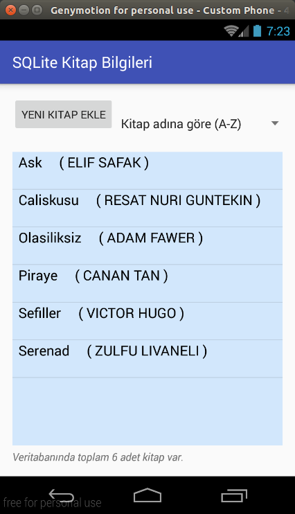
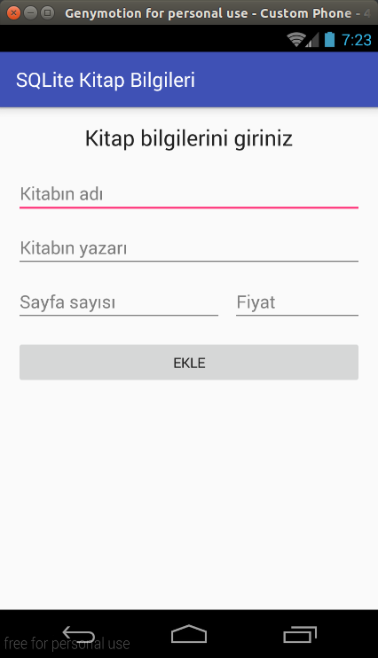

# Android SQLite ile kitap uygulaması 
Android ile sqllite kullanımını gösteren küçük bir örnek

Bu uygulamada
> (CREATE)  [Veritabanına yeni kitap ekleme,](app/src/main/java/com/ozcaan11/l50/sqlkitapbilgileri/Database.java#L88)        

> (READ)    [Veritabanından bütün kitapları çekme,](app/src/main/java/com/ozcaan11/l50/sqlkitapbilgileri/Database.java#L51)  

> (UPDATE)  [Veritabanındaki bir kitabı güncelleme,](src/main/java/com/ozcaan11/l50/sqlkitapbilgileri/Database.java#L88) 

> (DELETE)  [Veritabanındaki bir kitabı silme](app/src/main/java/com/ozcaan11/l50/sqlkitapbilgileri/Database.java#L101)      

işlemleri yapılabilmektedir.

----
### Ekran Görüntüleri

Ana Menü - 1 | Ana Menü - 2 	|
-------------|----------------|
|  |

-----

Yeni Kitap Ekle | Kitap Düzenleme|
----------------|----------------|
| 

--------

| [@ozcaan11](https://twitter.com/ozcaan11/)
---
